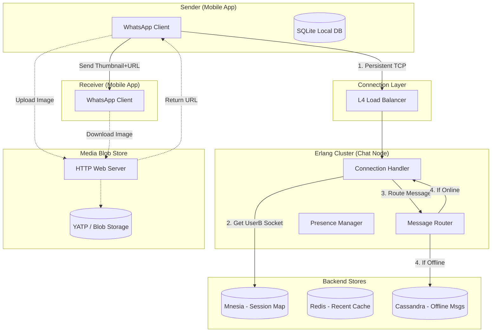

# System Design: Real-Time & Streaming Architectures

This document covers high-level architectural designs for Video Streaming (Netflix), Chat (WhatsApp), and Conferencing (Zoom), including detailed component interaction diagrams.

---

## 1. Netflix (Video on Demand)
**Scale**: 250M+ Users, 15% of Global Internet Traffic.
**Core Requirement**: High Availability, Low Latency Streaming (No Buffering).

### 1.1 Detailed Architecture Diagram

```mermaid
graph TD
    subgraph Client_Device ["Client Device (TV/Mobile)"]
        UI[Netflix UI]
        Player[Video Player]
    end

    subgraph Edge ["Netflix Edge (AWS)"]
        DNS[Geo DNS]
        ELB[Elastic Load Balancer]
        Zuul[Zuul API Gateway]
    end

    subgraph Backend_Services ["Microservices (Spring Boot)"]
        PlayAPI[Playback API]
        DiscAPI[Discovery/Search API]
        Steering[Steering Service]
        UserSvc[User/Auth Service]
        RecSvc[Recommendation Engine]
    end

    subgraph Data_Layer ["Data Persistance"]
        EVCache[(EVCache (Memcached))]
        Cassandra[(Cassandra Cluster)]
        Kafka[Kafka Data Pipeline]
    end

    subgraph Content_Pipeline ["Content Processing"]
        S3_Master[(AWS S3 Master Files)]
        Archer[Archer (Encoding Orchestrator)]
        Chunker[File Chunker]
    end

    subgraph CDN ["Open Connect (ISP)"]
        OCA[Open Connect Appliance]
    end

    %% Flow: Playback
    UI --> DNS
    DNS --> ELB
    ELB --> Zuul
    Zuul --> PlayAPI
    PlayAPI --> Steering
    Steering -->|Determinest best OCA| OCA
    Player -->|Stream Content| OCA

    %% Flow: Processing
    PlayAPI --> UserSvc
    PlayAPI --> RecSvc
    RecSvc --> Kafka
    
    %% Data
    PlayAPI --> EVCache
    EVCache --> Cassandra

    %% Encoding
    S3_Master --> Archer
    Archer --> Chunker
    Chunker -->|Push Pre-fetched content| OCA
```

### 1.2 The Tech Stack & Components
*   **Zuul Gateway**: Dynamic routing, monitoring, security, and resiliency (Circuit Breakers). Handles 10B+ requests/day.
*   **Hystrix**: Latency and fault tolerance library. Stops cascading failures.
*   **EVCache**: Based on Memcached, tailored for AWS. Stores customized personalization data (e.g., "Top picks for User X").
*   **Cassandra**: Stores viewing history. Optimized for heavy writes (Recording where you paused every 10 seconds).
*   **Steering Service**: Decides which **Open Connect** box specific to your ISP and location is healthiest to serve the video.

### 1.3 Key Strategy: "Chained Component Failure"
Netflix employs **Chaos Monkey** to kill random services.
*   *Fallback Strategy*: If the "Personalized Recommendation" service dies, Netflix falls back to "Generic Trending" list (cached) rather than showing an empty screen. The diagram flow reroutes automatically.

---

## 2. WhatsApp (Real-Time Chat)
**Scale**: 2B+ Users, 100B Messages/Day.
**Core Requirement**: Real-time delivery, Low Overhead, Connectivity.

### 2.1 Detailed Architecture Diagram



### 2.2 The Tech Stack & Strategies
*   **Erlang Processes**: Every user connection is a lightweight Erlang process (Actor model). It requires very little RAM, allowing massive vertical scaling.
*   **Mnesia DB**: An in-memory distributed DB built into Erlang. It stores the critical map: `UserID -> Machine_IP : Socket_ID`. This lookup must be sub-millisecond.
*   **YATP (Yet Another Traffic Poller)**: WhatsApp's internal performance tool to optimize network packet flows.

### 2.3 Optimization: "The Funnel"
WhatsApp optimization is purely about **Connection density**.
*   They optimized the FreeBSD kernel (TCP stack) to allow millions of open ports.
*   To save bandwidth: No headers (like HTTP) are used for chat. Customized binary protocol.

---

## 3. Zoom (Video Conferencing)
**Scale**: 300M+ Participants.
**Core Requirement**: Low Latency (UDP), Multipoint communication.

### 3.1 Detailed Architecture Diagram

```mermaid
graph TD
    subgraph Client ["Zoom Client"]
        SDK[Meeting SDK]
        Network[Network Adaptive Layer]
    end

    subgraph Control_Plane ["Signaling & Control (HTTP/TCP)"]
        Web[Web Server]
        GlobalCtrl[Global Controller]
        ZoneCtrl[Zone Controller]
        ZC_DB[(Redis/DynamoDB)]
    end

    subgraph Data_Plane ["Multimedia Transport (UDP/RTP)"]
        MMR_Edge[Multimedia Router (Edge) - SFU]
        MMR_Cloud[Multimedia Router (Cloud)]
    end

    subgraph Storage ["Cloud Recording"]
        S3[(AWS S3 / Oracle Cloud)]
    end

    %% Flow Setup
    SDK -->|1. Join Meeting (HTTPS)| Web
    Web -->|2. Assign ZC| GlobalCtrl
    GlobalCtrl -->|3. Assign Best MMR| ZoneCtrl
    
    %% Media Stream
    Network -->|4. Video Stream (RTP)| MMR_Edge
    MMR_Edge -->|5. Forward Stream| OtherClients[Other Participants]
    
    %% Recording
    MMR_Cloud -.->|Fork Stream| S3
```

### 3.2 Key Components
*   **Multimedia Router (MMR)**: The heart of Zoom. It implements the **SFU (Selective Forwarding Unit)** topology.
    *   It does *not* mix video (like MCU). It forwards packets.
    *   It separates audio and video streams.
*   **Zone Controller (ZC)**: Manages MMRs in a specific region (e.g., US-East). It acts as a Load Balancer for MMRs, assigning new meetings to the least loaded Router.
*   **Global Controller**: Acts as the "DNS" for meetings, routing users to the correct Zone Controller.

### 3.3 Strategy: "Last Mile Optimization"
*   **Adaptive Bitrate**: The Client SDK detects packet loss. If loss > 5%, it downgrades from HD (720p) to SD (360p) locally before sending.
*   **Application Layer FEC**: Forward Error Correction. It sends redundant data packets so if one is lost, the receiver can reconstruct the frame without asking for a retransmission (which takes too long).
