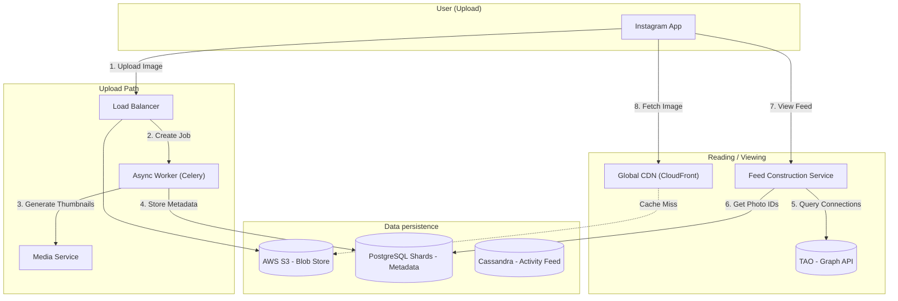

# System Design: Social Media & Discovery Architectures

This document covers architectures for Twitter (Feeds), Instagram (Media), and Tinder (Location/Discovery), featuring detailed flow diagrams.

---

## 1. Twitter / X (Timeline & Feeds)
**Scale**: 400M MAU, Read-Heavy (Reading tweets >> Writing tweets).
**Core Problem**: The "Justin Bieber" Issue (Fanout).

### 1.1 Detailed Architecture Diagram

```mermaid
graph TD
    subgraph User_Client ["Twitter Client"]
        App[Mobile / Web App]
    end

    subgraph Frontline ["Frontend / API Layer"]
        LB[Load Balancer]
        TweetSvc[Tweet Write Service]
        TimelineSvc[Timeline Read Service]
    end

    subgraph Core_Services ["Backend Services"]
        Fanout[Fanout Service]
        UserGraph[User Graph Service]
        Search["Search Service (Earlybird)"]
    end

    subgraph Data_Layer ["Storage & Cache"]
        Redis_User[("Redis - User UserTimeline")]
        Redis_Home[("Redis Cluster - Home Timeline")]
        Manhattan[("Manhattan DB - Tweet Store")]
        FlockDB[("FlockDB - Social Graph")]
    end

    %% Write Flow
    App -->|1. Post Tweet| TweetSvc
    TweetSvc -->|2. Persist| Manhattan
    TweetSvc -->|3. Index| Search
    TweetSvc -->|4. Trigger Fanout| Fanout
    
    Fanout -->|5. Get Followers| UserGraph
    UserGraph -.-> FlockDB
    
    Fanout -->|6A. Small Follower Count (Push)| Redis_Home
    Fanout -->|6B. Celebrity (Pull)| Redis_User

    %% Read Flow
    App -->|7. Get Feed| TimelineSvc
    TimelineSvc -->|8. Fetch Pre-computed| Redis_Home
    TimelineSvc -->|9. Merge Celebrity Tweets| Redis_User
```

### 1.2 Key Components & Strategy
*   **Fanout Service**: The engine of Twitter. It is an Async Task Queue (RabbitMQ/Kafka events).
    *   **Optimization**: It checks "Is this user active?". If a follower hasn't logged in for 30 days, we do *not* push the tweet to their Redis list (saves memory).
*   **Earlybird**: Built on Lucene. It manages the Real-time search index. Inverted Index is partitioned by Time (not ID) because recent tweets are searched 99% of the time.
*   **Manhattan**: Twitter's strongly consistent KV store. Used because "My tweet must exist before it appears in a timeline".

---

## 2. Instagram (Image Heavy Social)
**Scale**: 2B Users, Storage Intensive.
**Core Problem**: Efficiently storing and serving billions of photos with low latency.

### 2.1 Detailed Architecture Diagram



### 2.2 Key Components & Strategy
*   **Postgres Sharding**: Instagram places all data for one user on the *same* shard (User-centric sharding). This allows fast JOINs (e.g., Get all Photos for User X).
*   **TAO (The Associations and Objects)**: Facebook's read-optimized Graph Cache. Instead of joining SQL tables to find "Friends of Friends", they traverse the Graph in memory.
*   **Pre-generation**: Feeds are not built when you open the app. They are built in the background constantly so `GetFeed` is just a Redis `GET`.

---

## 3. Tinder (Location & Matchmaking)
**Scale**: 75M MAU, Geospatial Intensive.
**Core Problem**: Finding people "Near Me" efficiently.

### 3.1 Detailed Architecture Diagram

```mermaid
graph TD
    subgraph User ["Tinder User"]
        App[Mobile App]
        GPS[GPS Module]
    end

    subgraph API_Gateway ["Gateway (Nginx)"]
        WS[WebSocket Gateway]
        RestAPI[REST API]
    end

    subgraph Services ["Microservices"]
        GeoSvc[Geolocation Service]
        RecSvc[Recommendation Engine]
        ProfileSvc[Profile Service]
        MatchSvc[Match Service]
    end

    subgraph Data ["Datastores"]
        Redis_Geo[("Redis Geo/Cluster")]
        DynamoDB[("DynamoDB - Profiles")]
        Elastic[("Elasticsearch - Filters")]
        Kafka[Kafka - Likes Stream]
    end

    %% Location Update Flow
    GPS -->|1. Update Lat/Long| RestAPI
    RestAPI --> GeoSvc
    GeoSvc -->|2. GEORADIUS| Redis_Geo
    
    %% Swiping Flow
    App -->|3. Swipe Right| MatchSvc
    MatchSvc -->|4. Push Event| Kafka
    
    %% Recommendation Flow
    App -->|5. Get Potential Matches| RecSvc
    RecSvc -->|6. Query Region| Redis_Geo
    RecSvc -->|7. Apply Filters (Age/Tags)| Elastic
    RecSvc -->|8. Exclude Swiped| DynamoDB
```

### 3.2 Key Components & Strategy
*   **Elasticsearch (Complex Filters)**: Redis is fast for "Near Me", but bad for "Near Me + Age 25-30 + Dogs". Tinder uses Elastic to handle complex multi-field queries.
*   **Sharded Redis**: Geospatial indexes are dense. Tinder shards Redis by Location (e.g., Cell ID). This reduces lock contention in dense cities like NYC.
*   **WebSocket**: When a match occurs, it must be instant. The generic REST API isn't used for the "It's a Match!" screen; a persistent WebSocket push notification handles that.
