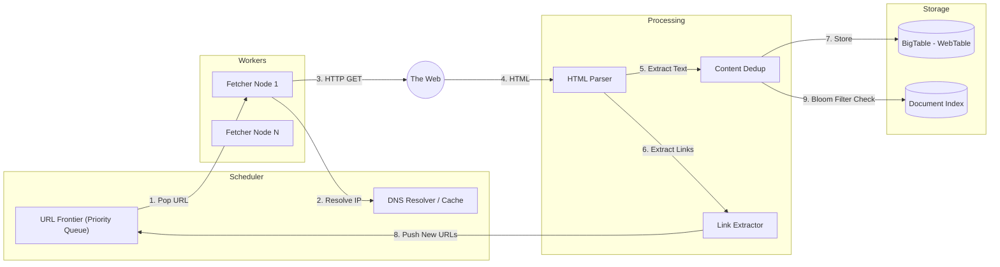

# System Design: Data Intensive & Logistics

This document covers architectures for Uber (Logistics), Amazon (Inventory), Dropbox (File), and Google Crawler, featuring detailed flow diagrams.

---

## 1. Uber (Real-Time Logistics)
**Scale**: 100M MAU, 14M Trips/Day.
**Core High-Level**: Matching Riders to Drivers within seconds under highly dynamic conditions.

### 1.1 Detailed Architecture Diagram

```mermaid
graph TD
    subgraph Mobile_Clients
        Rider[Rider App]
        Driver[Driver App]
    end

    subgraph Entry_Point ["Firewall & Routing"]
        WAF[WAF / Firewall]
        LB[Load Balancer]
        Edge[Edge Gateway]
    end

    subgraph DISCO ["DISCO (Dispatch System)"]
        SupplySvc["Supply Service (Drivers)"]
        DemandSvc["Demand Service (Riders)"]
        Matching[Matching Engine]
    end

    subgraph Geo_Core ["Geospatial Core"]
        Ringpop["Ringpop (Gossip/Sharding)"]
        GeoIndx[("Redis Geo Index")]
        Maps[Maps / ETA Service]
    end

    subgraph Trip_Mgmt ["Trip Lifecycle"]
        TripSvc[Trip Service]
        Events[Kafka - Trip Events]
        Archive[("Cassandra - Trip History")]
    end

    %% Driver Flow
    Driver -->|1. GPS Ping (4s)| Edge
    Edge --> SupplySvc
    SupplySvc -->|2. Update Location| GeoIndx
    SupplySvc -.->|3. Publish State| Ringpop

    %% Rider Flow
    Rider -->|4. Request Ride| Edge
    Edge --> DemandSvc
    DemandSvc -->|5. Find Candidates| GeoIndx
    DemandSvc -->|6. Calculate ETA| Maps
    
    %% Matching
    Matching -->|7. Select Driver| SupplySvc
    Matching -->|8. Notify Device| Driver
```

### 1.2 Key Components & Strategy
*   **DISCO (The Dispatcher)**: Written in Go. It handles the massive throughput of GPS ingestion.
*   **Ringpop**: A library by Uber. It creates a distributed application-layer sharding network.
    *   *Why?* DB is too slow. Uber maintains the state of all active drivers in **Memory**. Ringpop tells the API: "Driver X is handled by Node Y".
*   **Google S2 Geometry**: Geohash is rectangular and distorts at poles. S2 projects the earth onto a cube, then unfolds it. It's mathematically more accurate for ETA calculations.

---

## 2. Amazon / E-Commerce (High Consistency)
**Core Problem**: Inventory Management. You have 1 item left. 100 people click "Buy". Only 1 must succeed.

### 2.1 Detailed Architecture Diagram

```mermaid
graph LR
    subgraph Client
        Browser[Web Browser]
        App[Mobile App]
    end

    subgraph Front_Store ["Shopping Experience"]
        Catalog[Catalog Service]
        Cart[Cart Service]
        Recommend[Recommendation Svc]
    end

    subgraph Order_Pipeline ["Order Processing"]
         Checkout[Checkout Service]
         Order[Order Service]
         Inv[Inventory Service]
    end

    subgraph Databases
        Dynamo_Cart[("DynamoDB - Cart")]
        RDS_Inv[("Oracle/Aurora - Inventory")]
        ES[("Elasticsearch - Catalog")]
    end

    %% Flow
    Browser -->|1. Add to Cart| Cart
    Cart -->|2. Merge Vector Clock| Dynamo_Cart
    
    Browser -->|3. Place Order| Checkout
    Checkout -->|4. Create Order| Order
    
    Order -->|5. Reserve Item (Lock)| Inv
    Inv -->|6. SQL Update| RDS_Inv
    
    Inv -->|7a. Success| Order
    Inv -->|7b. Fail (OOS)| Order
    
    Order -->|8. Async Workflow| Fulfillment[Fulfillment Center]
```

### 2.2 Key Components & Strategy
*   **Vector Clocks (Cart)**: Amazon allows you to modify your cart on offline devices. When you come online, the server sees two versions of the cart. It uses Vector Clocks to merge them automatically or prompt the user.
*   **Inventory Service Lock**:
    *   **Optimistic Locking**: `UPDATE stock SET count = count-1 WHERE id=1 AND count > 0`. If Rows Affected = 0, item is out of stock.
    *   **Hard Limits**: For "Lightning Deals", Amazon might move stock to a Redis counter for ultra-fast decrement ops.

---

## 3. Dropbox (File Storage & Sync)
**Core Problem**: Syncing 1TB of data efficiently.

### 3.1 Detailed Architecture Diagram

```mermaid
graph TD
    subgraph User_PC ["Desktop Client"]
        File[File System]
        Watcher[File Watcher]
        Chunker[Chunker (4MB)]
        Hasher[SHA-256 Hasher]
    end

    subgraph Control ["Meta-Data Handling"]
        TalkService[Notification / Talk Service]
        MetaServer[Metadata Server]
        Edgestore[("Edgestore - Metadata DB")]
    end

    subgraph Block_Store ["Block Handling"]
        BlockServer[Block Server]
        MagicPocket[("Magic Pocket / S3")]
    end

    %% Upload Flow
    Watcher -->|1. Detect Change| Chunker
    Chunker -->|2. Hash Blocks| Hasher
    Hasher -->|3. Check Existence| MetaServer
    
    MetaServer -->|4a. Exists (Dedup)| Edgestore
    MetaServer -->|4b. Not Found| BlockServer
    
    BlockServer -->|5. Upload Bytes| MagicPocket
    BlockServer -->|6. Confirm Commit| MetaServer
    
    %% Sync Flow
    TalkService -.->|7. Push Notification| OtherClients
```

### 3.2 Key Components & Strategy
*   **Magic Pocket**: Dropbox wrote their own Exabyte-scale storage system in Rust because S3 was becoming too expensive. It optimizes for "Cold Storage" (files rarely accessed).
*   **4MB Chunks**:
    *   If you edit 1 sentence in a 1GB Thesis, you only change *one* 4MB chunk.
    *   Dropbox only uploads that 1 chunk (Delta Sync), saving massive bandwidth.

---

## 4. Google Crawler (Web Search)
**Core Problem**: Downloading the entire internet (billions of pages).

### 4.1 Detailed Architecture Diagram



### 4.2 Key Components & Strategy
*   **URL Frontier**: It's not just a FIFO queue. It contains logic:
    *   **Politeness**: "When did I last hit cnn.com? Wait 2s."
    *   **Priority**: "Is this highly PageRanked? Crawl often."
*   **Custom DNS**: Standard DNS libraries block threads. Google wrote a non-blocking asynchronous DNS resolver that can handle millions of resolutions per second.
*   **Content Fingerprinting**: A 64-bit checksum of the text. If 2 URLs allow the same content (Duplicate), only 1 is stored.
